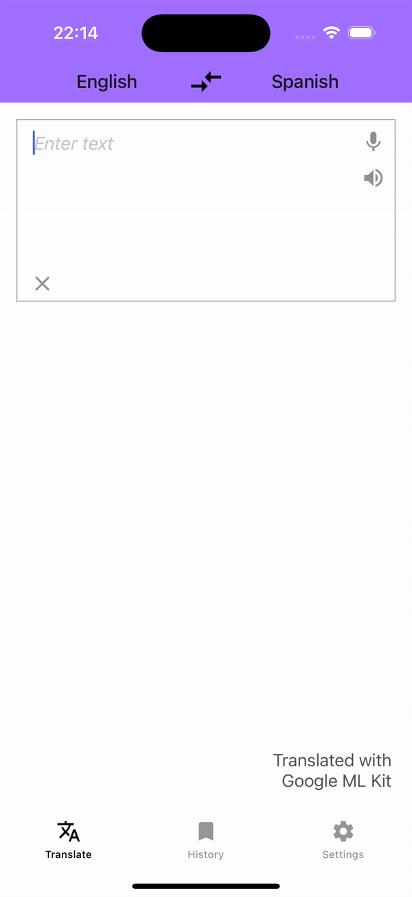

# translator-kmm
A simple text translation app based on KMM and Google ML Kit.

**Shared module uses:**
* [Moko-mvvm](https://github.com/icerockdev/moko-mvvm)
* [Moko-resources](https://github.com/icerockdev/moko-resources)
* [Kotlin coroutines](https://github.com/Kotlin/kotlinx.coroutines)
* [Koin](https://github.com/InsertKoinIO/koin)
* [SqlDelight](https://github.com/sqldelight/sqldelight)
* [Google ML Kit](https://developers.google.com/ml-kit/language/translation)

UI is built using ViewBinding for Android, Storyboards and UIKit for iOS

